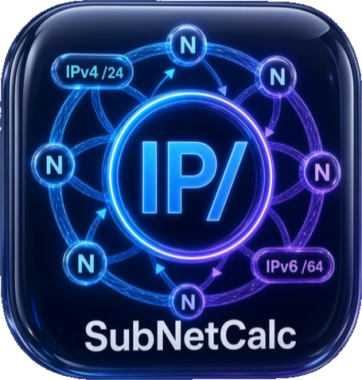

<!-- markdownlint-disable-file MD033 MD041 -->

<p align="center">
  <a href="https://github.com/alsyundawy/SubnetCalc-Windows">
    
  </a>
</p>

<p align="center">
  <a href="https://github.com/alsyundawy/SubnetCalc-Windows">
    
  </a>
</p>

<h1 align="center">SubnetCalc for Windows</h1>

<h3 align="center">High-Performance, Pure Native C11 & Win32 IPv4 & IPv6 Subnet Calculator for Windows 7 SP1+ (x86 & x64)</h3>

<p align="center">
  <a href="https://github.com/alsyundawy/SubnetCalc-Windows/releases"></a>
  <a href="https://microsoft.com/windows"></a>
  <a href="https://en.wikipedia.org/wiki/C11_(C_standard_revision)"></a>
  <a href="https://learn.microsoft.com/en-us/windows/win32/"></a>
  <a href="https://github.com/alsyundawy/SubnetCalc-Windows/blob/master/LICENSE"></a>
  <a href="https://github.com/alsyundawy/SubnetCalc-Windows/actions/workflows/ci.yml"></a>
  <a href="https://github.com/alsyundawy/SubnetCalc-Windows/security/code-scanning"></a>
</p>

<p align="center">
  A production-grade, zero-dependency native Windows desktop utility for network engineers, systems administrators, and infrastructure architects. <b>SubnetCalc for Windows</b> delivers instantaneous IPv4 and IPv6 subnet calculations, real-time bidirectional mask synchronization, bitmapped network/subnet/host visualizations, FLSM and VLSM allocation decomposition, multi-cloud VPC/VNet subnet profiles (AWS, Azure, GCP, OCI), RFC 4193 ULA generation, and spreadsheet-injection-safe CSV export (CWE-1236) — compiled natively with <b>zero runtime dependencies</b> (no .NET, no MSVC Redistributable, no UCRT required).
</p>

<p align="center">
  <a href="https://github.com/alsyundawy/SubnetCalc-Windows/actions/workflows/ci.yml">
    
  </a>
  <a href="https://github.com/alsyundawy/SubnetCalc-Windows/releases">
    
  </a>
  <a href="https://github.com/alsyundawy/SubnetCalc-MacOS">
    
  </a>
</p>

---

## 📋 Table of Contents

- [Key Architecture & Core Principles](#-key-architecture--core-principles)
- [Algorithmic Parity Baseline](#-algorithmic-parity-baseline)
- [Feature Matrix](#-feature-matrix)
- [Supported Platforms & Hardware Requirements](#-supported-platforms--hardware-requirements)
- [Binary Packaging & Downloads](#-binary-packaging--downloads)
- [Verification & Integrity (SHA-256)](#-verification--integrity-sha-256)
- [Building from Source](#-building-from-source)
- [CI/CD & Security Auditing](#-cicd--security-auditing)
- [Upstream Attribution & Author Credits](#-upstream-attribution--author-credits)
- [Support & Donations](#-support--donations)
- [License](#-license)

---

## ⚡ Key Architecture & Core Principles

1. **Zero External Runtime Overhead**:
   - **No .NET Framework / .NET Core**: Completely self-contained executable.
   - **No Microsoft Visual C++ Redistributable (VCRedist)**: Links directly to `msvcrt.dll`, guaranteed to exist on stock Windows 7 SP1 installations.
   - **No Universal CRT (UCRT) Dependency**: Avoids the KB2999226 prerequisite trap.
   - **No Heavy Frameworks**: No Electron, Qt, wxWidgets, or Chromium dependencies.
2. **Pure ISO C11 & Strict Win32 Wide APIs**:
   - Built with `-std=c11` and `-municode`.
   - DPI-aware via `SetProcessDPIAware` for crisp rendering on modern high-DPI monitors without breaking Windows 7 SP1.
   - Modular engine boundary: all network math in `src/engine/` is free of `windows.h` and GUI dependencies.
3. **Hardware & Cryptographic Rigor**:
   - Uses `BCryptGenRandom` (with `CryptGenRandom` fallback) for RFC 4193 IPv6 ULA Global ID entropy (CWE-330 compliant; zero use of predictable `rand()`).
   - No prohibited modern NT6.3+ calls like `ProcessPrng` or `bcryptprimitives.dll`.
4. **Spreadsheet-Safe Data Export**:
   - Full RFC 4180 CSV compliance with automated defense against CSV formula injection (CWE-1236 prefixing with `'`).

---

## 🎯 Algorithmic Parity Baseline

This project is a strict derivative work of **[SubnetCalc-MacOS v2.6.2](https://github.com/alsyundawy/SubnetCalc-MacOS)**. All mathematical logic, boundary constraints, and profile tables are engineered to maintain 100% computational parity:

- **RFC 3021 /31 Point-to-Point Links**: 2 usable host addresses (both network and broadcast are usable).
- **RFC 790 Classful & Classless Math**: Exact class bits, subnet bits, host bits, dotted netmask, and wildcard representation.
- **Cloud Subnet Provider Profiles**:
  - **AWS VPC**: 5 reserved addresses (minimum prefix /28). Usable range `network + 4` through `broadcast - 1`.
  - **Azure VNet**: 5 reserved addresses (minimum prefix /29). Usable range `network + 4` through `broadcast - 1`.
  - **Google Cloud (GCP)**: 4 reserved addresses (minimum prefix /29). Usable range `network + 2` through `broadcast - 2`.
  - **Oracle Cloud (OCI)**: 3 reserved addresses (minimum prefix /30). Usable range `network + 2` through `broadcast - 1`.
  - **Standard**: 2 reserved addresses (network and broadcast) for prefixes ≤ /30.
- **IPv6 RFC 5952 Formatting**: Canonical lowercase compressed text representation, longest-zero-sequence reduction, reverse-nibble DNS pointer generation (`ip6.arpa`), IPv4-mapped (`::ffff:0:0/96`), and 6to4 (`2002::/16`) conversions.

---

## 🖥️ Supported Platforms & Hardware Requirements

| Operating System | Architectures | Minimum Service Pack | Required Runtime |
| :--- | :--- | :--- | :--- |
| **Windows 7** | x86 (32-bit), x64 (64-bit) | Service Pack 1 (SP1) | **None** (Built-in `msvcrt.dll`) |
| **Windows 8 / 8.1** | x86 (32-bit), x64 (64-bit) | Any | **None** |
| **Windows 10** | x86 (32-bit), x64 (64-bit) | Version 1507+ | **None** |
| **Windows 11** | x64 (64-bit) | Any | **None** |
| **Windows Server** | 2008 R2 SP1, 2012, 2016, 2019, 2022, 2025 | Recommended SP | **None** |

---

## 📦 Binary Packaging & Downloads

Every tagged release and CI workflow produces two independent distribution packages per architecture:

1. **Portable Zero-Install ZIP**:
   - `SubnetCalc-Windows-x86.zip` (containing `SubnetCalc-x86.exe`)
   - `SubnetCalc-Windows-x64.zip` (containing `SubnetCalc-x64.exe`)
   - **No administrator rights required**. Extract and run instantly from anywhere (USB drive, Desktop, Network Share).
2. **Standard NSIS Setup Installer**:
   - `SubnetCalc-Windows-x86-setup.exe`
   - `SubnetCalc-Windows-x64-setup.exe`
   - Installs cleanly into Program Files, registers a Start Menu shortcut, and registers a standard Add/Remove Programs uninstaller.

> [!NOTE]
> **Windows SmartScreen Notice**:
> Binaries in v1.0.0 are built transparently on GitHub Actions and are unsigned (no paid commercial Authenticode EV certificate). Windows SmartScreen may display an *"Unknown Publisher"* prompt on initial launch. You can safely click *"More info"* -> *"Run anyway"*. Always verify the binary integrity using the published `SHA256SUMS` file.

---

## 🔒 Verification & Integrity (SHA-256)

To verify the integrity of downloaded binaries via PowerShell:

```powershell
# Verify single binary
Get-FileHash -Algorithm SHA256 .\SubnetCalc-Windows-x64-setup.exe

# Or verify entire checksum table
Get-Content SHA256SUMS
```

---

## 🛠️ Building from Source

### Cross-Compiling on Linux (Ubuntu 22.04 / 24.04)

```bash
# Install prerequisite toolchain
sudo apt-get update
sudo apt-get install -y build-essential gcc-mingw-w64 binutils-mingw-w64 zip nsis cppcheck clang-format

# Run unit tests on host
bash tools/build.sh test

# Build release packages (portable ZIPs and NSIS installers)
bash tools/build.sh release

# Verify PE import table constraints (guarantees zero prohibited DLLs)
bash tools/check-imports.sh
```

---

## 🛡️ CI/CD & Security Auditing

All commits and pull requests trigger automated verification pipelines:

- **`ci.yml`**: Host test suite, cppcheck static analysis, clang-format verification, MinGW-w64 cross-compilation, NSIS installer compilation, and PE import table audit.
- **`codeql.yml`**: GitHub CodeQL static application security testing (SAST) for C/C++.
- **`security.yml`**: Gitleaks secret detection across all git commits.
- **`release.yml`**: Deterministic release asset builds triggered strictly on version tags (`v*.*.*`).

---

## ⚠️ Upstream Attribution & Author Credits

> **Original Author & Creator:**<br>
> **[`JULIEN MULOT`](https://github.com/mulot)** — [`https://subnetcalc.mulot.org`](https://subnetcalc.mulot.org)<br>
> Original author of SubnetCalc for macOS ([`mulot/SubnetCalc`](https://github.com/mulot/SubnetCalc)). Julien Mulot pioneered desktop subnet calculations on macOS, introducing the AppKit Cocoa layout, bidirectional slider controls, binary/hexadecimal mapping, FLSM and VLSM decomposition, and persistent session history.

> **Ported, Architected & Maintained by:**<br>
> **[`HARRY DERTIN SUTISNA ALSYUNDAWY (@alsyundawy)`](https://github.com/alsyundawy)** — [`ALSYUNDAWY IT SOLUTION`](https://alsyundawy.com)<br>
> Creator of the Windows C11/Win32 port, modern multi-architecture CI/CD pipelines, cloud profile extensions, and security hardening.

- 🍏 **[`SubnetCalc for macOS`](https://github.com/alsyundawy/SubnetCalc-MacOS)**
- ⚡ **[`SubnetCalc for Windows Releases`](https://github.com/alsyundawy/SubnetCalc-Windows/releases)**
- 🐛 **[`Issue Tracker`](https://github.com/alsyundawy/SubnetCalc-Windows/issues)**
- 📜 **[`Changelog`](CHANGELOG.md)**

---

## 💖 Support & Donations

If **SubnetCalc for Windows** assists you in your network administration or engineering tasks, please consider supporting the authors:

### ☕ Support Original Author: Julien Mulot

[](https://www.buymeacoffee.com/0TC98Sk)

- **Direct Link**: [`https://www.buymeacoffee.com/0TC98Sk`](https://www.buymeacoffee.com/0TC98Sk)

### 💳 International Support for Maintainer: PayPal

[](https://www.paypal.me/alsyundawy)

- **PayPal Link**: [`https://www.paypal.me/alsyundawy`](https://www.paypal.me/alsyundawy)

### 🇮🇩 Indonesian & Regional Support: QRIS

Scan the QRIS barcode below using any Indonesian mobile banking application or e-wallet (BCA, Mandiri, BRI, BNI, GoPay, OVO, DANA, LinkAja, ShopeePay):


---

## 📜 License

This project is licensed under the **GNU General Public License v2 (GPL-2.0)**.
See the [LICENSE](LICENSE) file for the full license text.
